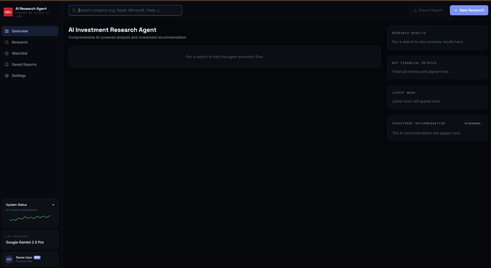
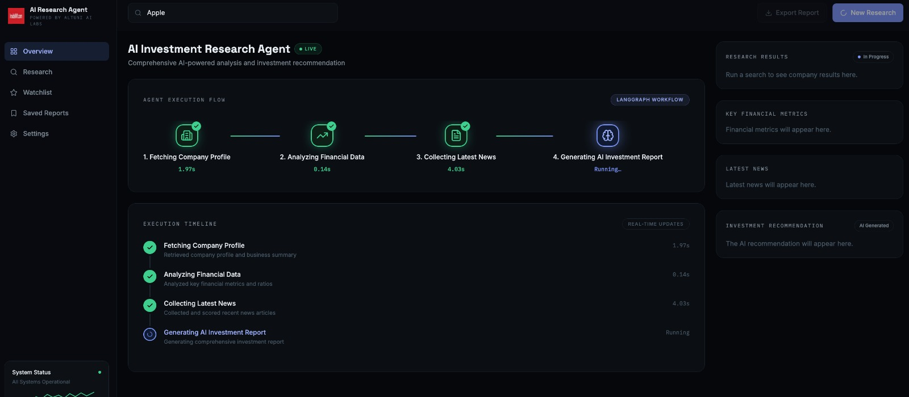
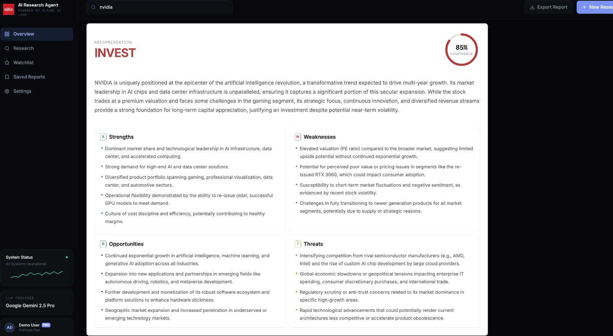
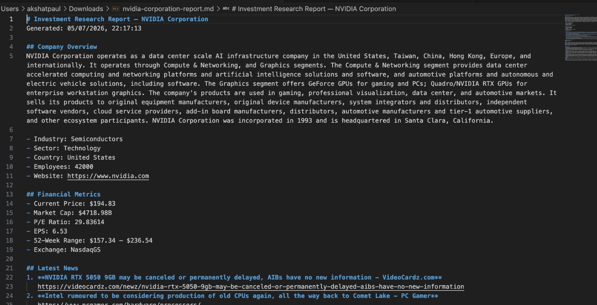
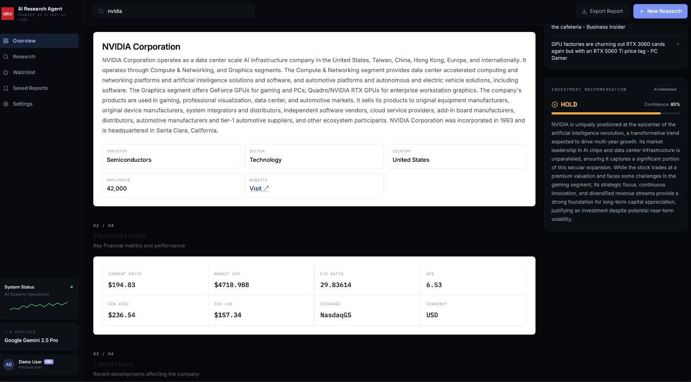
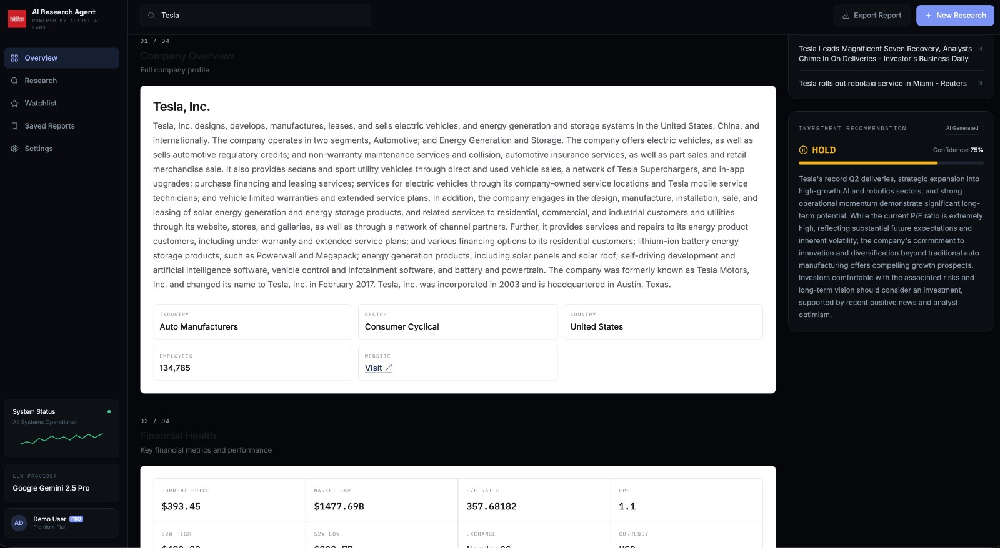
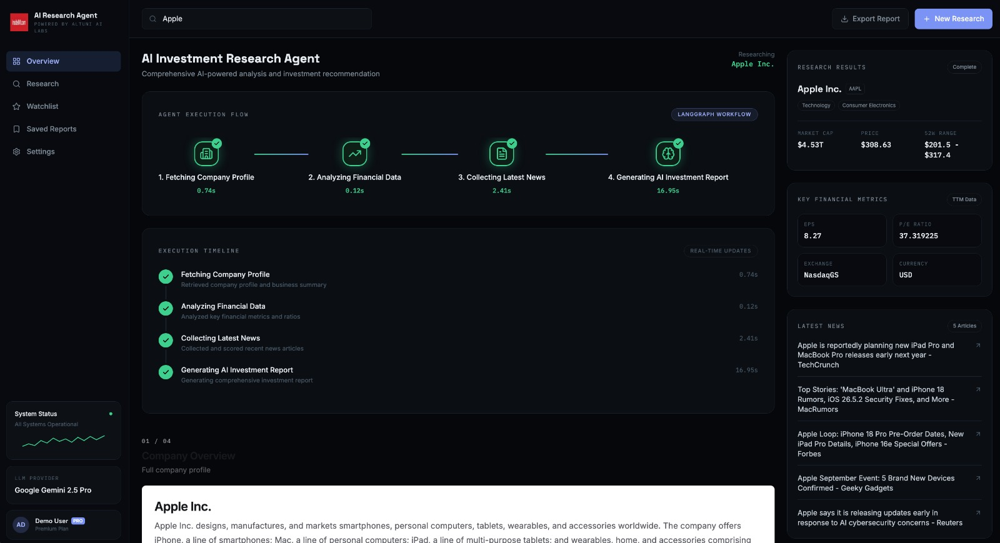

# AI Investment Research Agent

> **An AI-native investment research workspace powered by LangGraph and Google Gemini that autonomously researches public companies, evaluates financial data and market sentiment, and generates transparent investment recommendations through a real-time execution pipeline.**


---

## Overview

The AI Investment Research Agent simulates the workflow of a professional equity research analyst by orchestrating a multi-stage AI pipeline using **LangGraph**.

Rather than generating a recommendation from a single prompt, the application performs a structured investigation consisting of:

- Company Profile Research
- Financial Analysis
- Market News Collection
- AI-powered Investment Reasoning
- Investment Recommendation Generation

Every stage executes independently and streams its progress to the frontend in real time using **Server-Sent Events (SSE)**, allowing users to observe how the AI reaches its conclusion instead of only seeing the final result.

The project was designed around one core principle:

> **Trust is built by exposing the AI's investigation process—not just its final recommendation.**

---

# Features

The AI Investment Research Agent is designed to emulate the workflow of a professional equity research analyst by combining structured financial data, market intelligence, and AI reasoning into a single investigation pipeline.

### AI Research Pipeline

- 🔍 Research any publicly listed company by simply entering its name.
- 🤖 Execute a multi-stage AI workflow orchestrated using **LangGraph**.
- 📊 Retrieve and analyze company fundamentals and financial metrics.
- 📰 Collect and summarize the latest market news relevant to the company.
- 🧠 Generate an AI-powered investment recommendation using Google Gemini.
- 📄 Produce a structured investment report including:
  - Executive Summary
  - Investment Thesis
  - SWOT Analysis
  - Key Risks
  - Confidence Score
  - Final Recommendation

---

### Real-Time AI Execution

Unlike traditional stock analysis tools, the application exposes the complete investigation process.

- ⚡ Live execution of every LangGraph node.
- 📡 Real-time progress updates using **Server-Sent Events (SSE)**.
- 🌐 Interactive execution flow visualization.
- 📈 Live execution timeline showing every completed research stage.
- ✨ Transparent AI workflow from research to recommendation.

---

### Modern AI Workspace

The application is designed as an AI-native research workspace rather than a traditional financial dashboard.

- 🎯 AI-first user experience.
- 📂 Organized investigation workflow.
- 📑 Export generated investment reports.
- 🎨 Clean, responsive, dark-themed interface.
- ⚙️ Modular architecture for future multi-agent expansion.


# Application Preview

## Home Workspace



The landing page provides a clean AI workspace where users can initiate a new investment investigation.

---

## Live Agent Execution



The LangGraph workflow streams every execution stage in real time, allowing users to observe how the AI gathers evidence before reaching a conclusion.

---

## Investment Recommendation



Once the investigation is complete, the AI generates a structured investment report with executive summary, SWOT analysis, risks, confidence score, and final recommendation.

---

## Export Report



Users can export the generated investment report for future reference or sharing.


---

# Technology Stack

The project is built using a modern JavaScript stack focused on modularity, real-time communication, and AI workflow orchestration.

| Layer | Technology |
|--------|------------|
| **Frontend** | React 19, Vite, Tailwind CSS v4 |
| **UI & Animations** | Framer Motion, Lucide React |
| **Charts & Visualization** | Recharts |
| **HTTP Client** | Axios |
| **Backend** | Node.js, Express.js |
| **AI Workflow** | LangGraph.js |
| **LLM** | Google Gemini 2.5 Flash |
| **Financial Data** | Yahoo Finance API |
| **Real-Time Updates** | Server-Sent Events (SSE) |
| **Version Control** | Git & GitHub |

---

## Why This Stack?

The technology choices were driven by the objective of building an AI-native research platform rather than a traditional CRUD application.

- **React** provides a modular component architecture for building an interactive research workspace.
- **Tailwind CSS** enables rapid UI development while maintaining a consistent design system.
- **Framer Motion** is used to create meaningful animations that communicate the AI's execution state instead of purely decorative effects.
- **LangGraph** orchestrates the research pipeline into independent, reusable workflow nodes.
- **Google Gemini** generates structured investment reports with consistent JSON responses.
- **Yahoo Finance API** supplies reliable company fundamentals and financial metrics.
- **Server-Sent Events (SSE)** stream the progress of each LangGraph node to the frontend in real time, allowing users to observe the AI investigation as it unfolds.


---

# Project Architecture

The application follows a modular client-server architecture where the frontend is responsible for visualizing the AI investigation, while the backend orchestrates a multi-stage research workflow using **LangGraph**.

Instead of relying on a single LLM prompt, the system decomposes the research process into independent stages, allowing each step to execute sequentially while streaming progress updates to the user.

## High-Level Architecture

```text
                   ┌───────────────────────────┐
                   │       React Frontend      │
                   │  AI Research Workspace    │
                   └─────────────┬─────────────┘
                                 │
                     HTTP Request │
                                 ▼
                   ┌───────────────────────────┐
                   │      Express Backend       │
                   │    Research Controller     │
                   └─────────────┬─────────────┘
                                 │
                                 ▼
                   ┌───────────────────────────┐
                   │      Research Service      │
                   └─────────────┬─────────────┘
                                 │
                                 ▼
                   ┌───────────────────────────┐
                   │        LangGraph          │
                   │  AI Research Workflow     │
                   └─────────────┬─────────────┘
                                 │
          ┌──────────────┬──────────────┬──────────────┐
          ▼              ▼              ▼              ▼
 Company Profile   Market Analysis   Latest News   Gemini Analysis
          │              │              │              │
          └──────────────┴──────────────┴──────────────┘
                                 │
                                 ▼
                    Structured Investment Report
                                 │
                                 ▼
                     Real-Time Dashboard Update
```

---

## LangGraph Research Pipeline

Every company investigation follows the same deterministic workflow.

```text
START
   │
   ▼
Company Profile
   │
   ▼
Financial Analysis
   │
   ▼
Latest News
   │
   ▼
AI Investment Analysis
   │
   ▼
END
```

Each node performs a dedicated responsibility before passing structured data to the next stage, ensuring the final recommendation is based on a complete investigation rather than a single AI prompt.

---

## Real-Time Execution Flow

The backend streams the execution status of every LangGraph node using **Server-Sent Events (SSE)**.

```text
LangGraph Node
      │
      ▼
Timeline Event
      │
      ▼
Event Emitter
      │
      ▼
SSE Endpoint
      │
      ▼
React Frontend
      │
      ▼
Live Execution Timeline
```

This allows users to observe the AI investigation as it progresses, improving transparency and trust in the generated recommendation.


---

# How It Works

The AI Investment Research Agent follows a structured research pipeline that simulates the workflow of a professional equity research analyst.

Instead of relying on a single AI prompt, the application gathers evidence from multiple sources before generating a recommendation.

## Research Workflow

```text
User Searches Company
          │
          ▼
Frontend sends research request
          │
          ▼
Express Backend receives request
          │
          ▼
LangGraph starts execution
          │
          ▼
Company Profile Research
          │
          ▼
Financial Market Analysis
          │
          ▼
Latest News Collection
          │
          ▼
Google Gemini Investment Analysis
          │
          ▼
Structured Investment Report
          │
          ▼
Frontend Dashboard Updates
```

---

## Step 1 — Start an Investigation

The user enters the name of a publicly listed company and clicks **Analyze Company**.

The frontend sends a request to the backend to initiate a new AI research workflow.

---

## Step 2 — LangGraph Orchestrates the Workflow

The backend initializes a LangGraph workflow where every node has a dedicated responsibility.

Each node executes independently before passing structured data to the next stage.

The workflow consists of:

- Company Profile
- Financial Analysis
- News Collection
- AI Investment Analysis

---

## Step 3 — Gather Structured Evidence

Before any recommendation is generated, the system collects information from multiple sources.

### Company Profile

Retrieves fundamental information such as:

- Company Name
- Industry
- Sector
- Market Capitalization
- Business Description

### Financial Analysis

Collects key financial metrics including:

- Current Market Price
- Revenue
- Profit Margins
- Valuation Metrics
- Other financial indicators

### Latest News

Retrieves recent company-related news to identify significant developments that may influence investment decisions.

---

## Step 4 — AI Investment Analysis

After all research stages are complete, the collected data is passed to Google Gemini.

The AI synthesizes the information into a structured investment report containing:

- Executive Summary
- Investment Thesis
- SWOT Analysis
- Key Risks
- Confidence Score
- Final Recommendation

---

## Step 5 — Real-Time Execution Updates

During execution, every LangGraph node emits progress events using Server-Sent Events (SSE).

The frontend subscribes to these events and updates the execution timeline in real time, allowing users to observe how the AI investigation progresses from research to recommendation.

---

## Step 6 — Review & Export

Once the investigation is complete, users can:

- Review the complete investment report
- Inspect financial metrics and supporting evidence
- View the execution history
- Export the generated report for future reference


---

# Installation & Setup

## Prerequisites

Before running the project, ensure the following are installed:

- Node.js (v20 or later recommended)
- npm
- Git
- A Google Gemini API Key

---

## Clone the Repository

```bash
git clone https://github.com/akshat2508/AI-investment-agent.git

cd AI-investment-agent
```

---

## Install Dependencies

### Frontend

```bash
cd client

npm install
```

---

### Backend

```bash
cd server

npm install
```

---

# Environment Variables

Create a `.env` file inside the **server** directory.

```env
GEMINI_API_KEY=YOUR_GEMINI_API_KEY
```

Replace `YOUR_GEMINI_API_KEY` with your own Google Gemini API key.

---

# Running the Application

## Start the Backend

```bash
cd server

npm run dev
```

The backend will start on:

```
http://localhost:3000
```

---

## Start the Frontend

Open another terminal.

```bash
cd client

npm run dev
```

The frontend will start on:

```
http://localhost:5173
```

---

# Using the Application

1. Open the frontend in your browser.
2. Enter the name of a publicly listed company (e.g., Apple, NVIDIA, Tesla).
3. Click **Analyze Company**.
4. Observe the live AI execution workflow.
5. Review the generated investment report.
6. Export the report if required.

---

# Project Structure

```text
AI-investment-agent/

├── client/
│   ├── components/
│   ├── hooks/
│   ├── pages/
│   ├── services/
│   └── utils/
│
├── server/
│   ├── agents/
│   ├── controllers/
│   ├── events/
│   ├── prompts/
│   ├── routes/
│   ├── services/
│   ├── tools/
│   └── utils/
│
├── docs/
├── llm-transcripts/
└── README.md
```


---

# Example Runs

The following examples demonstrate the AI Investment Research Agent executing its complete research workflow on different publicly listed companies. Each investigation follows the same LangGraph pipeline:

```
Company Profile
        ↓
Financial Analysis
        ↓
Latest News
        ↓
AI Investment Analysis
        ↓
Investment Recommendation
```

---

## Example 1 — NVIDIA Corporation

**Recommendation:** 🟢 **INVEST**

**Confidence:** **85%**

### Executive Summary

NVIDIA continues to maintain a dominant position in the AI infrastructure market through its leadership in GPU computing and accelerated data centers. Strong industry demand, strategic partnerships, and continued investment in AI infrastructure reinforce its long-term growth potential. Although the company trades at a premium valuation and faces increasing competition, its technological leadership and expanding ecosystem support a positive long-term investment outlook.

### Key Investment Thesis

- Market leader in AI compute infrastructure and enterprise GPUs.
- Strong long-term demand driven by cloud computing and artificial intelligence.
- Strategic partnerships and ecosystem expansion continue to strengthen competitive advantages.

### Screenshot



---

## Example 2 — Tesla Inc.

**Recommendation:** 🟡 **HOLD**

**Confidence:** **65%**

### Executive Summary

Tesla demonstrates strong operational momentum with record vehicle deliveries and continued expansion into AI, robotics, and autonomous driving. However, the current valuation remains exceptionally high, with significant future growth already reflected in the stock price. While long-term opportunities remain attractive, execution risks and aggressive capital expenditure justify a more cautious investment stance.

### Key Investment Thesis

- Record vehicle deliveries and expanding energy business strengthen long-term fundamentals.
- AI, Full Self-Driving, Robotaxi, and Optimus create substantial future growth opportunities.
- Premium valuation and execution risks limit near-term upside despite strong business performance.

### Screenshot



---

## Example 3 — Apple Inc.

**Recommendation:** 🟡 **HOLD**

**Confidence:** **75%**

### Executive Summary

Apple remains one of the world's strongest technology companies with a highly profitable ecosystem, expanding services business, and continued investment in AI-enabled products. However, its premium valuation, rising production costs, and pricing pressures reduce the margin of safety for new investors. The AI therefore recommends holding existing positions while monitoring future product launches and profitability.

### Key Investment Thesis

- Industry-leading ecosystem with strong recurring revenue from services.
- Continuous innovation across hardware, software, and AI-powered products.
- Premium valuation and pricing headwinds justify a balanced investment outlook.

### Screenshot



---

### Observations

The three investigations illustrate how the AI adapts its recommendation based on the available financial data, market conditions, and recent news rather than applying a fixed decision rule.

| Company | Recommendation | Confidence |
|---------|---------------|-----------:|
| NVIDIA | 🟢 INVEST | **85%** |
| Tesla | 🟡 HOLD | **65%** |
| Apple | 🟡 HOLD | **75%** |

Across all investigations, the LangGraph workflow remained identical while the reasoning, SWOT analysis, risk assessment, and final recommendation were generated dynamically using the collected evidence.


---

# Key Design Decisions & Trade-offs

Building an AI Investment Research Agent involved several architectural decisions that prioritized modularity, explainability, and user trust over simply producing a recommendation. The following sections summarize the major design choices and the trade-offs considered during development.

---

## 1. LangGraph for Workflow Orchestration

Instead of generating the investment report using a single LLM prompt, the research process was decomposed into multiple independent workflow nodes using **LangGraph**.

### Why?

- Clear separation of responsibilities between research stages.
- Modular architecture that allows individual nodes to evolve independently.
- Easier debugging and testing of each research stage.
- Straightforward future expansion into parallel or multi-agent workflows.

### Trade-off

The current workflow executes sequentially, resulting in a slightly longer execution time compared to parallel processing. This was intentionally chosen to keep the research pipeline deterministic and easier to reason about.

---

## 2. Server-Sent Events (SSE) for Real-Time Updates

The frontend receives live execution updates through **Server-Sent Events**.

### Why?

The research pipeline is a one-way stream of execution events from the server to the client. SSE provides a lightweight and reliable solution without the additional complexity of maintaining full-duplex WebSocket connections.

### Trade-off

SSE is optimized for server-to-client communication and does not support bidirectional messaging. For this project, the simpler architecture was a better fit for the application's requirements.

---

## 3. Google Gemini for Investment Reasoning

Google Gemini is responsible for synthesizing structured research data into a professional investment report.

### Why?

- Strong reasoning capabilities.
- Reliable structured JSON generation.
- Fast response times suitable for interactive applications.
- Well-suited for producing consistent executive summaries, SWOT analyses, and investment recommendations.

### Trade-off

The quality of the final recommendation depends on the quality and completeness of the collected research data. Improvements to upstream data sources directly improve the AI's reasoning.

---

## 4. Yahoo Finance as the Financial Data Source

Yahoo Finance was selected as the primary source for company profiles and financial metrics.

### Why?

- Reliable financial fundamentals.
- Publicly accessible API.
- Sufficient coverage for the scope of the assignment.
- Easy integration into the research pipeline.

### Trade-off

Enterprise-grade financial platforms provide deeper datasets and historical analytics, but they require commercial licenses and were beyond the scope of this implementation.

---

## 5. AI-Native User Experience

Instead of presenting only the final recommendation, the interface exposes the complete investigation process.

### Why?

One of the primary design goals was to improve user trust by making the AI's workflow visible.

The application therefore visualizes:

- Agent execution flow.
- Live research timeline.
- Individual workflow stages.
- Progress of the LangGraph pipeline.
- Final reasoning and recommendation.

This shifts the experience from a traditional financial dashboard to an AI-native research workspace.

---

## 6. Exportable Research Reports

The generated investment report can be exported directly from the dashboard.

### Why?

Investment research is often consumed outside the application for documentation, sharing, or future reference. Export functionality improves the practical usability of the generated reports.

---

## Trade-offs & Scope Limitations

To keep the project focused within the assignment timeline, several advanced capabilities were intentionally left out.

### Included

- Modular LangGraph workflow
- Real-time execution visualization
- Financial analysis
- News aggregation
- AI-generated investment reports
- Exportable research reports

### Deferred for Future Work

- Multi-agent collaboration
- Parallel workflow execution
- Portfolio analysis
- Historical report storage
- User authentication
- Persistent database
- RAG over SEC filings and annual reports
- Live market monitoring
- Company comparison mode
- Advanced financial charting

The architecture was intentionally designed to support these future enhancements without requiring significant changes to the existing workflow.


---

# What I Would Improve With More Time

The current implementation was designed to deliver a complete end-to-end AI investment research workflow within the assignment timeline. While the core functionality is complete, the modular architecture allows several meaningful extensions.

---

## AI & Research

### Multi-Agent Research Pipeline

Instead of relying on a single reasoning agent, the workflow could be expanded into multiple specialized agents, each responsible for a specific aspect of the investigation.

Example:

```
Market Analyst

↓

Financial Analyst

↓

News Analyst

↓

Risk Analyst

↓

Investment Decision Agent
```

This would improve reasoning quality through specialized analysis and collaborative decision-making.

---

### RAG over Financial Documents

Integrate Retrieval-Augmented Generation (RAG) using company annual reports, SEC filings, earnings call transcripts, and investor presentations.

This would allow recommendations to reference official corporate disclosures rather than relying solely on structured financial data and recent news.

---

### Historical Recommendation Tracking

Store every generated report and allow users to compare how recommendations evolve over time as new financial results and market events emerge.

---

## Workflow Improvements

### Parallel LangGraph Execution

The current workflow executes sequentially.

Future versions could execute independent nodes—such as financial analysis and news collection—in parallel to reduce total execution time while maintaining the same final output.

---

### Intelligent Caching

Cache frequently requested company profiles and financial data to reduce redundant API calls and improve response times for repeated investigations.

---

## User Experience

### Interactive Financial Charts

Integrate historical stock price charts, revenue growth trends, and valuation metrics to provide richer visual context alongside the AI-generated recommendation.

---

### Company Comparison Mode

Allow users to investigate multiple companies simultaneously and compare:

- Financial performance
- News sentiment
- SWOT analysis
- AI recommendations
- Confidence scores

This would support comparative investment research rather than evaluating companies individually.

---

### Saved Investigations

Enable users to save completed research reports, revisit previous analyses, and maintain a searchable history of investment investigations.

---

## Infrastructure

### Authentication & User Profiles

Introduce user authentication to support:

- Personal workspaces
- Saved reports
- Investigation history
- Personalized watchlists

---

### Persistent Database

Store completed investigations, execution history, and exported reports in a database to enable long-term analysis and historical insights.

---

## Explainable AI

While the application already exposes the execution pipeline, future iterations could provide richer explanations for each recommendation by explicitly linking individual financial metrics and news articles to the AI's conclusions.

This would further improve transparency and help users better understand the reasoning behind every investment decision.

---

## Long-Term Vision

The long-term vision of this project is to evolve from a single-company research tool into an AI-native investment research platform capable of conducting multi-agent investigations, comparing investment opportunities, continuously monitoring market developments, and generating explainable, evidence-backed recommendations for investors.


---

# Additional Documentation

Additional engineering documentation has been included to provide deeper insight into the system architecture, design decisions, and development process.

```text
docs/
├── architecture.md
├── design-decisions.md
├── ai-development-process.md
└── screenshots/
```

### Documentation

| Document | Description |
|----------|-------------|
| `architecture.md` | High-level system architecture, LangGraph workflow, request lifecycle, and real-time execution pipeline. |
| `design-decisions.md` | Engineering decisions, architectural trade-offs, technology choices, and future scalability considerations. |
| `ai-development-process.md` | Development journey, implementation phases, and how AI was integrated throughout the software engineering lifecycle. |

---

# AI-Assisted Development

This project was intentionally developed using AI as an engineering partner throughout the software development lifecycle.

Rather than relying on AI solely for code generation, it was used to assist with:

- Technology research and evaluation
- System architecture design
- LangGraph workflow planning
- Prompt engineering
- Product and UX reviews
- Debugging and implementation planning
- Documentation refinement

As requested in the assignment, the complete AI development conversation has been included in the repository.

```text
llm-transcripts/
├── README.md
└── AI-Investment-Agent-Development.pdf
```

The transcript documents the project's evolution from initial planning through architecture discussions, implementation, iterative refinement, and final submission.

---

# Repository

```text
AI-investment-agent/
├── client/
├── server/
├── docs/
├── llm-transcripts/
└── README.md
```

---

# Author

**Akshat Paul**

B.Tech Computer Science Engineering

Developed as part of the **InsideIIM × Altuni AI Labs AI Engineering Assignment**.